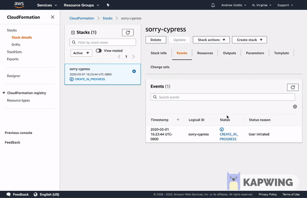
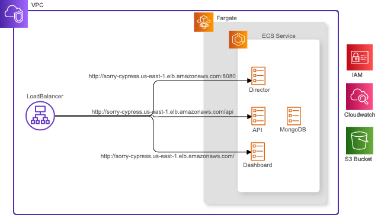

# AWS

### Cloud Formation Stack <a id="cloud-formation"></a>

It takes just 5 minutes to deploy full sorry-cypress kit on AWS using AWS Cloud Formation template.

 

1. Click the button, follow on-screen instructions
2. Wait for deployment to complete
3. Go to "Output" section of Cloud Formation task to see access URLs
4. Reconfigure cypress to use `DirectorURL` from the previous step.
5. That's it! 



Alternatively, use the commands below

```bash
aws cloudformation create-stack --template-url https://s3.amazonaws.com/agoldis.dev/sorry-cypress/sorry-cypress-stack.yml --capabilities CAPABILITY_IAM --stack-name sorry-cypress-2
```

### Stack Overview

The Cloud Formation stack uses AWS Elastic Container Service \(ECS\) to run sorry-cypress services. The configuration includes networks and Load Balancer for secure and convenient access.



The artifacts created by the stack are:

* Director URL - this is what you provide when [configure cypress agent to use the alternative dashboard.](../../cypress-agent/configuring-cypress-agent.md)
* Dashboard URL - web dashboard access URL
* API URL - GraphQL API access URL
* [S3 storage bucket]() - for storing tests video recordings and screenshots
* Cloudwatch log groups for debugging and troubleshooting

### Template Configuration

`StackName (default: "sorry-cypress")`

Defines the stack name, also serves a prefix name for all the entities created by the stack. Please keep it short and no special characters as AWS limits service names. 

`TaskCpu (default: 1024)`

The amount of CPU units dedicated to running the services. Sorry-cypress uses AWS Fargate as compute platform, and runs all the services as a single task, i.e. those CPU units are shared among all the services. Read more about at [AWS Documentation](https://docs.aws.amazon.com/AmazonECS/latest/developerguide/task_definition_parameters.html#task_size)

`TaskMemory (default: 2048)`

The amount of memory units dedicated to running the services. This resource is also shared between the services and defined at task-level. Read more at [AWS Documentation](https://docs.aws.amazon.com/AmazonECS/latest/developerguide/task_definition_parameters.html#task_size)\`\`

`DirectorPort (default: 8080)`

The port number for accessing the director service. You'll need to use it as a destination when [configuring cypress agents](../../cypress-agent/configuring-cypress-agent.md).

The stack creates [AWS Application Load Balancer](https://docs.aws.amazon.com/elasticloadbalancing/latest/application/introduction.html) to provide access to the underlying services. By default, AWS LB URL points to the web dashboard \(on port `80`\). The director service is available via the same URL but different port.

 For example, if the access URL created by the stack is `http://sorry-cypress-1502240720.us-east-1.elb.amazonaws.com`, and `DirectorPort=8080` then `director` service will be available at `http://sorry-cypress-1502240720.us-east-1.elb.amazonaws.com:8080`

### AWS Pricing

You're only paying for AWS resources. Here's a rough estimator of price / month for using the resources used . The actual usage might be higher \(or lower\) based on actual usage

* Fargate pricing based on [calculator](http://fargate-pricing-calculator.site.s3-website-us-east-1.amazonaws.com/) **35.546 USD** \(1 vCPU, 2GB RAM\) or **17.773 USD** \(0.5 vCPU, 1GB RAM\)
* EC2 Application Load Balancer based on [calculator](https://aws.amazon.com/elasticloadbalancing/pricing/) **19.35 USD** \(0.5 GB / hour, 0.5 connections / second\)
* S3 + Cloudwatch = varies based on usage

Too expensive? Try [free Heroku setup](../heroku.md).

