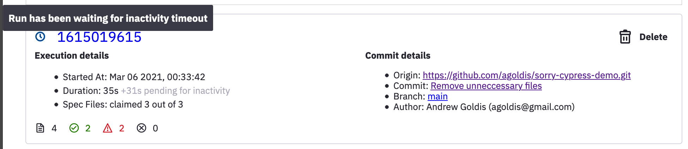

# Inactivity Timeout

`Inactivity Timeout` is a setting that defines how long should we wait until checking for a run's inactivity.

Having an "inactivity timeout" is a way to deal with:

* Stale / terminated cypress agents that never report results back
* Slow CI machines that start running tests later than other machines

For example, having two cypress agents running, each presented by a timeline below:  

We start "inactivity timeout" when run starts; we restart it every time a new test file is requested. 

When "inactivity timeout" expires, we check if all tests are done. If so, we set the whole run as completed. If there're pending or still running tests, the whole run is marked as "expired".

#### Setting Inactivity Timeout

You can change "Inactivity Timeout" in Project Settings. Please note the following implications when setting "Inactivity Timeout":

* Every spec \(not test\) should complete within "Inactivity Timeout", otherwise the whole run will be marked as "expired" \(even though SC will still collect test results\). 
* SC will wait up to "Inactivity Timeout" seconds **after** the last spec started before marking the whole run as completed, even if all the specs have finished before. That might delay reporting RUN\_FINISH when using Integrations.


Try breaking down your tests into smaller spec files to achieve balanced "Inactivity Timeout" that works for your specific use case


#### Inactivity Timeout Reporting

The dashboard will indicate the runs that are waiting for "Inactivity timeout" to expire

