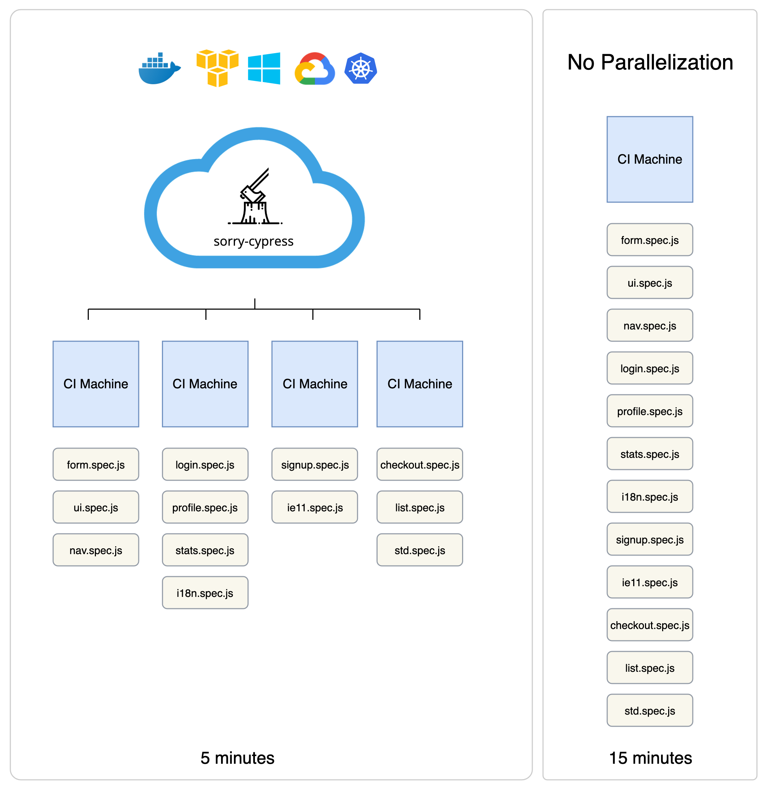

# Parallelization Explained


EDIT: Check out the new parallelization guide available at [https://currents.dev/readme/guides/parallelization](https://currents.dev/readme/guides/parallelization)


Parallelizing cypress tests means running different tests with multiple cypress agents at the same time. The [official Cypress documentation](https://docs.cypress.io/guides/guides/parallelization.html) greatly explains why is it good. In short, it allows to greatly reduce the overall time of running your tests.

When an agent is configured to run tests in parallel, it tries to connect to a remote service to coordinate the tests running order. Sorry-cypress is such a service.&#x20;

It coordinates requests from cypress agents, providing each agent with different tests to run. It also collects test results for browsing.&#x20;

You will still need to set up (and pay for) a CI environment that runs cypress agents.&#x20;

When using sorry-cypress you'll need to [override the default configuration](../integrating-cypress/configuring-cypress-agent.md) to set an alternative URL for contacting the remote dashboard.&#x20;
