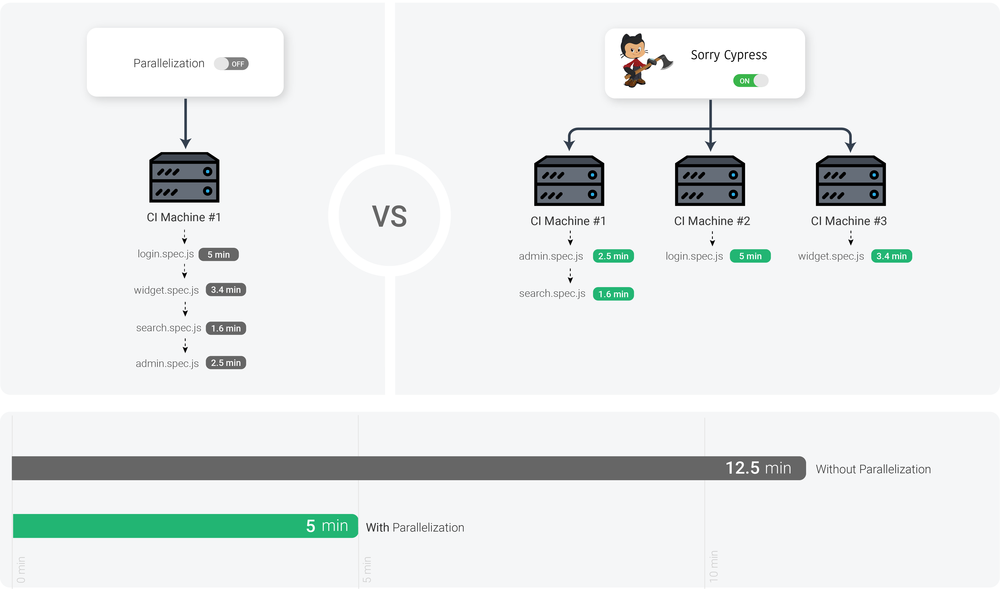

# Parallelization Explained

Cypress agent is the tool that runs the tests. 

Parallelizing cypress tests means running different tests with multiple cypress agents at the same time. The [official Cypress documentation](https://docs.cypress.io/guides/guides/parallelization.html) greatly explains why is it good.

When an agent is configured to run tests in parallel, it tries to connect to a remote service to coordinate the tests running order. Sorry-cypress is such a service. 

It coordinates requests from cypress agents, providing each agent with different tests to run. It also collects test results for browsing. 

You will still need to set up \(and pay for\) a CI environment that runs cypress agents. 

When using sorry-cypress you'll need to [override the default configuration](../cypress-agent/configuring-cypress-agent.md) to set an alternative URL for contacting the remote dashboard. 

