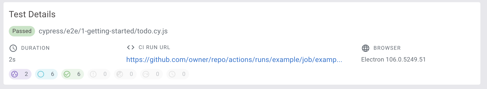

# Test Details



| Field             | Description                                                          |
| ----------------- | -------------------------------------------------------------------- |
| Status            | [Test Status](test-status.md "mention")                              |
| Test File Path    | The full path of the test file                                       |
| Duration          | Test duration                                                        |
| CI Run URL        | The URL of the CI job running the Cypress tests                      |
| Browser           | Cypress tests browser                                                |

### CI Run URL

An environment variable is used to get the CI Run URL. It needs to be set before the Cypress tests start running in the CI configuration file. Here's an example of how to obtain the URL with [Github Actions](https://currents.dev/posts/github-actions-cypress-job-url).

```
CI_RUN_URL = https://github.com/owner/repo/actions/runs/run_id/job/job_id
```
