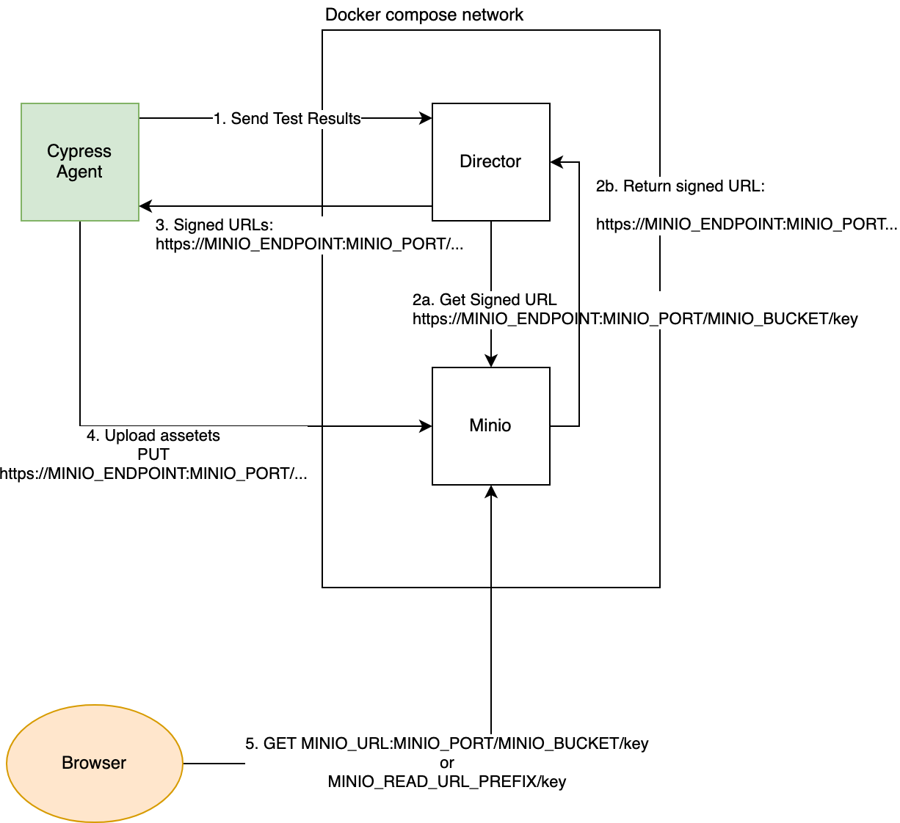

# Minio Configuration

Minio is an awesome tool that allows using local storage \(or any other supported provider\) instead of AWS S3.  

Sorry-cypress integrates with the major remote cloud storage solution via [Minio S3 Gateway](https://docs.min.io/docs/minio-gateway-for-s3.html), that is compatible with:

* Google Cloud Storage
* IBM COS
* Azure Blob Storage
* NAS
* HDFS
* Local storage

In order to use minio as storage driver provider, you need to configure director service 

```text
SCREENSHOTS_DRIVER="../screenshots/minio.driver"
```

And also provide other configuration options \(see below\).

#### Configuration Options


Treat your Minio keys and secrets AWS credentials and hide them. 



Refer to[`docker-compose.minio.yml`](https://github.com/sorry-cypress/sorry-cypress/blob/master/docker-compose.minio.yml)for Minio setup example.


`MINIO_ACCESS_KEY="defaultAccessKey"`

Minio Access Key


`MINIO_SECRET_KEY="defaultSecret"`

Minio Secret


`MINIO_BUCKET="sorry-cypress"`

Bucket name for storing generated artifacts. Please make sure that the bucket is created and configured properly before using it.


`MINIO_URL="https://storage.yourdomain.com"`

The public URL used for public read access to the stored screenshots and videos. This URL should be available from your browser and it will be used to fetch generated screenshots and videos.


`MINIO_PORT=9000`

Port that `director` and cypress agents will use to communicate with Minio.


`MINIO_ENDPOINT="storage.yourdomain.com"`

Hostname or IP address that **both `director` and cypress agents** \(see the detailed explanation below\) will use to communicate with `minio` service.

* Please make sure that your network configuration allows access to Minio resource for cypress agents and for Director service
* To run on the local machine, edit your `/etc/hosts` file to allow cypress agents discover the local instance of Minio `127.0.0.1 localhost`


`MINIO_READ_URL_PREFIX=null`

You can override the whole read URL, including the bucket name using this variable. Most chances you won't need it, if you do, see the [source code](https://github.com/sorry-cypress/sorry-cypress/blob/master/packages/director/src/screenshots/minio/minio.ts#L42).


`MINIO_USESSL="false"`

Whether `director` should use SSL for communicating with `minio`.

### Caveats of using Minio

I have seen people being challenged by configuring minio and sorry cypress for non-trivial use cases. 

We need to understand first how cypress uploads videos and screenshots to remote storage to be aware of limitations and caveats.

1. When cypress finishes running a spec file, it reports the results to sorry-cypress \(director service\)
2. Director service analyzes the results and, if needed, generates a **signed upload URL** for each asset, using `MINIO_ENDPOINT` and `MINIO_PORT`configuration variables \(see below\). That means:
   1. Director should be able to access minio service within your network configuration using `MINIO_ENDPOINT` and `MINIO_PORT`
   2. Once the signed upload URL is generated it only can be used **using the same hostname, port and path** that were used to generate it
3. Director sends back to cypress agent the list of signed upload URLs
4. Cypress agent uploads the assets using the signed upload URLs. For successful upload:
   1. Cypress agent should be able to access the signed upload URL that was generated earlier
   2. You must not modify the URL, otherwise the signature wouldn't match and the upload requests would fail
5. Eventually, a browser will try to read the assets uploaded during steps 1-4. Since the read operation doesn't require signed URL, we have more freedom to use different URLs for read request - see `MINIO_URL` and `MINIO_READ_URL_PREFIX`




Part of a Signed Upload URL is a unique signature, the signature contains 

* hostname + port
* path

Minio verifies that all elements if the signature match when serving upload reqests, otherwise the requests fail


The  implications of this flow \(and where most people are getting confused\) are:

* Director and cypress agents have to use the same hostname to access minio
* Director and cypress should be able to access minio service using the hostname and port you've defined

Here are two most common scenarios of misconfigured network:

#### Scenario A

Minio service is available as `storage`  and port is `9000` within your docker-compose. network. director will generate a signed URL that looks like `http://storage:9000/bucket/key...`

Cypress agents will try to upload their files use the URL 👆🏻, if they cannot reach minio service using that URL, the upload request will fail 😈

**Scenario B**

You've configured and verified that minio service is available at http://storage.yourcompany.com for cypress agents \(external network\). However, your docker-compose network doesn't have a proper DNS configuration, and director cannot reach minio service at http://storage.yourcompany.com. Director will silently fail to connect to minio and won't return any upload URLs.  😈

#### What should I do then?

As long as you're able to configure your network so that director and cypress agents can reliable access minio using exactly the same URL, every solution would work. 

If you have a simple and proven solution, please consider sharing.

