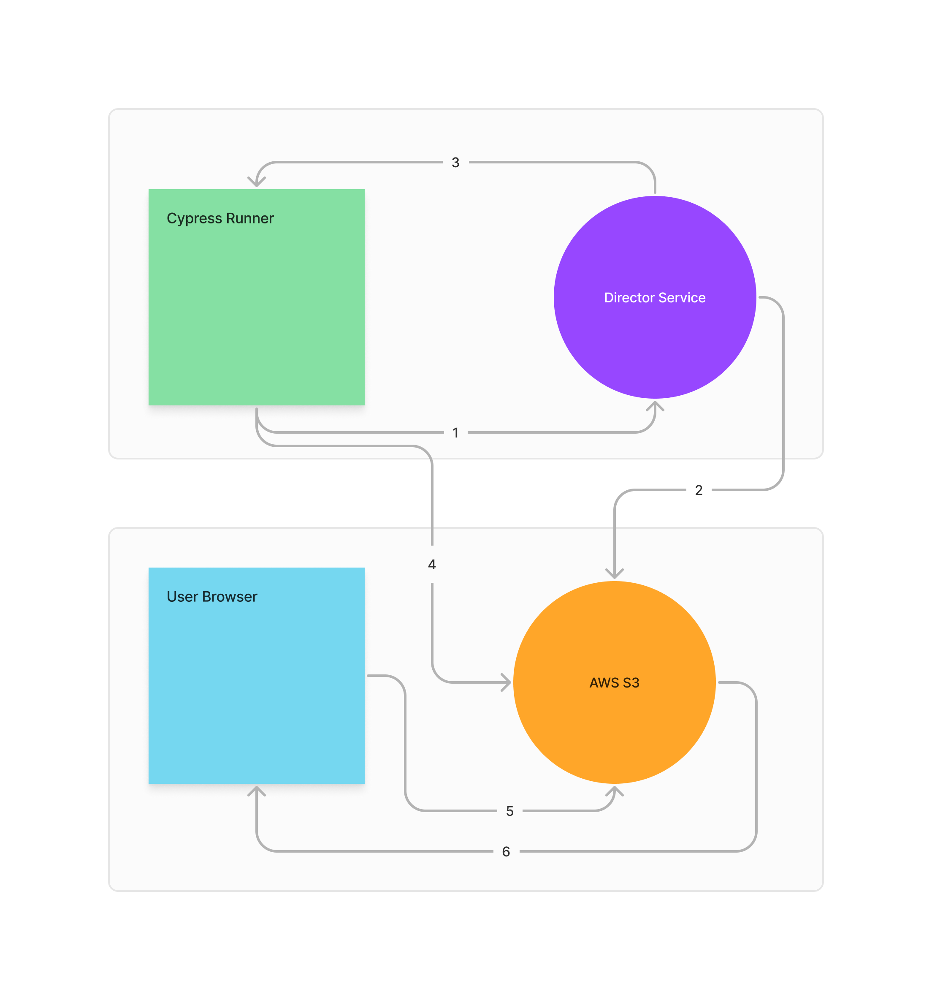

# Troubleshooting

This is a collection of most common questions associated with Sorry Cypress setup

### Can I use a private AWS  S3 bucket with sorry-cypress?

This is not trivial. If you find a proper configuration, please contribute to this documentation for others to follow. Please refer to the following scheme for reference.

1. **Upload flow:** Cypress runner reports its results to director service
2. Director service get [signed S3 upload URL](https://docs.aws.amazon.com/AmazonS3/latest/userguide/PresignedUrlUploadObject.html) from the configured AWS S3 bucket (or any other object storage compatible service - e.g. [minio](director-configuration/minio-configuration.md))
3. Director service sends back the signed S3 upload URL, stores the read URL in a DB
4. Cypress runner uses the signed upload URL to upload the screenshots / videos
5. **Read flow:** a browser reads the test results and uses the read URL from a DB
6. AWS S3 returns the content to the browser

### Cypress Parallelization is not working - I see a separate build for each machine

* Please make sure you understand how [CI Build ID](https://currents.dev/readme/guides/cypress-ci-build-id) affects [Parallelization](https://currents.dev/readme/guides/parallelization)
* Please make sure your MongoDB instance has all the [indexes defined](https://github.com/sorry-cypress/sorry-cypress/blob/master/packages/mongo/src/db.ts#L72). The indexes are required for parallelization to work.

### Why isn't Sorry Cypress Dashboard working? I cannot see test results!

Most chances something is wrong with your setup or the way you're connecting to sorry-cypress. Try following the next steps for troubleshooting before submitting support requests.

*   Make sure Sorry Cypress services are up and running

    * Director service is reachable, is connected to the right DB and it logs the requests
    * API service is reachable and is connected to the right DB and it logs the requests
    * Dashboard loads with empty results

*   Ensure you're [reconfiguring cypress](../cypress-agent/cy2.md) to use Director's service URL.&#x20;

    * Run cypress in debug mode `DEBUG=cypress:server:*` to see the details of network requests - the debug mode works both when running  `cypress` and  `cy2`
    * Examine Director service log files to see the incoming requests

* Examine the logs files
  * Run cypress runner in debug mode - `DEBUG=cypress:server:* cypress run ...`
  * Examine sorry-cypress log files and identify the relevant
* Check out available [Support](../support.md) options if you still need help. Collect all the relevant logs, configuration, describe the desired and the actual results.

###
