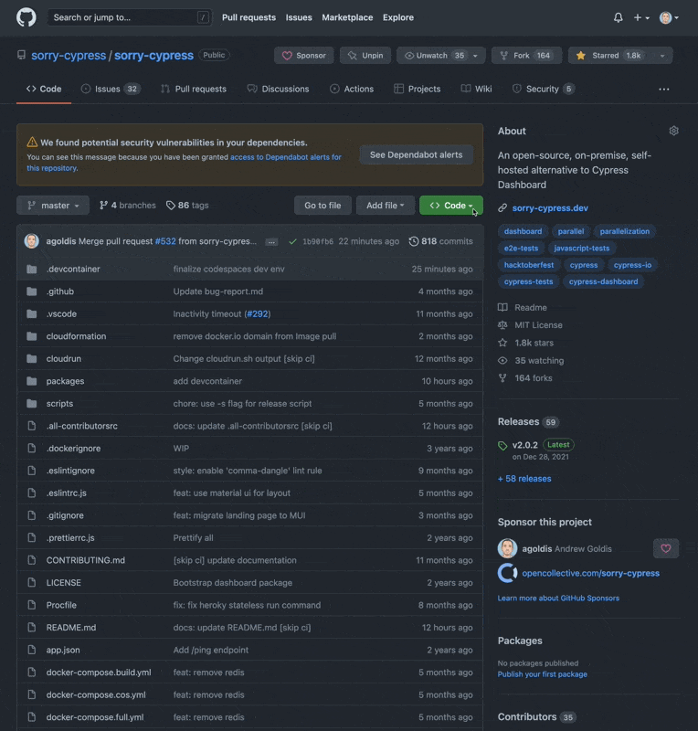

# Development Guide

### GitHub Codespaces

Start developing using remote, pre-configured environment within minutes.

Sorry Cypress supports remote development using [GitHub Codespaces.](https://github.com/features/codespaces) All the services are pre-configured to run in a remote, containerized environment and allows starting developing within minutes.


To start, create a new codespace using [sorry-cypress/sorry-cypress](https://github.com/sorry-cypress/sorry-cypress) as a source



Within the Codespace, open a terminal and run

```
yarn && yarn dev
```

This command will start all the internal services and will expose the ports on localhost:

* 8080 - dashboard
* 1234 - director
* 4000 - API
* 9000 - minio

Open [http://localhost:8080](http://localhost:8080) to see the dashboard in action.


To start sending cypress tests to your dev instance, run:

```
 CYPRESS_API_URL=http://localhost:1234/ && \
 yarn cy2 run --parallel --record --key whatever
```

#### Tips

* Don't use broser-based VS Code to connect to a codespace - it doesn't allow access to sorry-cypress services via `localhost`
* If the services become unavailable via published ports, delete and re-add them in "Ports" tab of VS Code
* Run `yarn killall && yarn dev` to stop and start all the services - sometimes they hang and keep their ports busy

### Local Development

We use yarn workspaces, please use `yarn`. &#x20;

### Add `.env` configuration to services

Add `.env` file with the following contents:

```
# packages/director/.env
EXECUTION_DRIVER="../execution/mongo/driver"
SCREENSHOTS_DRIVER="../screenshots/minio.driver"
MINIO_ACCESS_KEY='MW32h3gd6HvjBEgTRx'
MINIO_SECRET_KEY=t6NgQWUcEyG2AzaDCVkN6sbWcvDCVkN6sGiZ7
MINIO_ENDPOINT='storage'
MINIO_URL='http://localhost'
MINIO_PORT='9000'
MINIO_USESSL='false'
MINIO_BUCKET=sorry-cypress

# packages/dashboard/.env
GRAPHQL_SCHEMA_URL=http://api.sc.com:4000
```

### Override `localhost` network

Add the following entries to `/etc/hosts` or an equivalent file on Windows

```
127.0.0.1 storage
127.0.0.1 api.sc.com
```

### Start `minio` and `mongo` background services&#x20;

```
docker-compose -f ./docker-compose.minio.yml up -d storage mongo createbuckets
```

Make sure that associated services are available on the localhost - e.g. `mongo`, `minio`

### Start all the services in dev mode

`yarn dev`

* The dashboard should be available at [http://localhost:8080](http://localhost:8080)
* Director service should be available at [http://localhost:1234](http://localhost:1234)

Send new tests to dashboard using this command:

```bash
CYPRESS_API_URL=http://localhost:1234/ \
cy2 run --record --key whatever --parallel --ci-build-id `date +%s`
```

### Prevent CI

Add `[skip ci]` to commit message to skip running CI.

### Releasing a new version

We use semver standard.

Every commit to master triggers [CI via GH Actions](https://github.com/sorry-cypress/sorry-cypress/tree/master/.github/workflows), which builds new docker images, assign tags and pusher the new images to DockerHub.

After pushing a new tagged please go ahead and create a new Github [release](https://github.com/sorry-cypress/sorry-cypress/releases) with a summary and attributions.

### Releasing `latest` tag

Pushing to master automatically created new docker images with `latest` tags

#### Releasing tagged version e.g. `v1.0.0-beta.4`

1. Run `yarn release` to create a new release.
2. Push to master. Push to master, together with tags `git push origin master --tags`. Pushing to master will trigger CI that will actually update dockerhub.

Pushing a properly formatted (semver) git tag starts release of dockerhub images tagged accordingly. E.g. `v0.5.2` will release dockerhub tags `v0, v0.5, v0.5.2`.

The script does the following behind the scenes:

* Update all `package.json` files (we release all together and do not increase / release individual packages version)
* Commit with message, e.g. `v0.5.2`
* Add git tag, e.g. `git tag v0.5.2`
