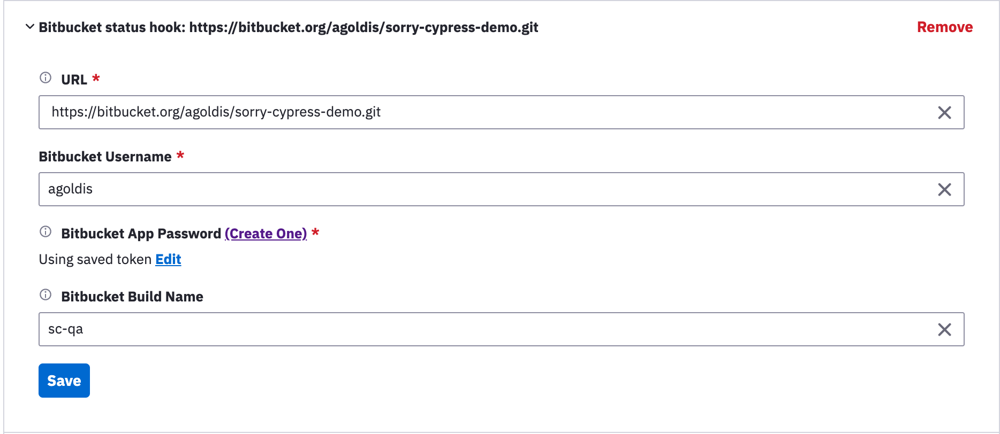
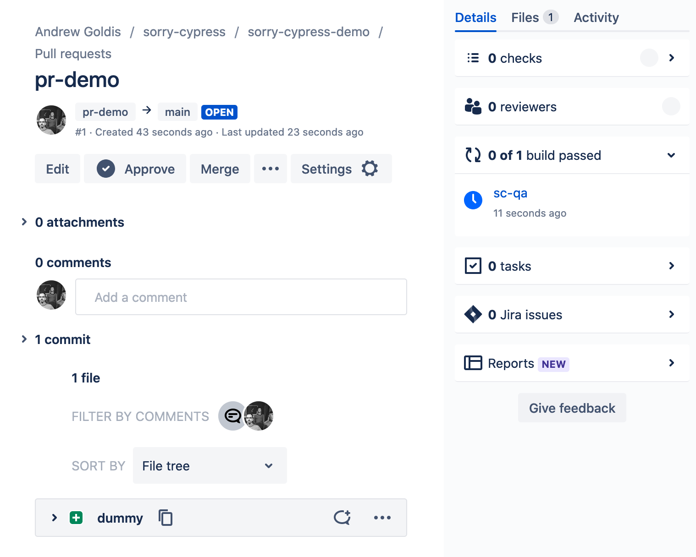

# Bitbucket Integration

Integrating with Bitbucket allows [reporting build status](https://developer.atlassian.com/server/bitbucket/how-tos/updating-build-status-for-commits/) for your commits and pull requests. Use the web dashboard Project Settings to add or edit Bitbucket Integration.

Sorry-cypress would update build status to failure / success.

