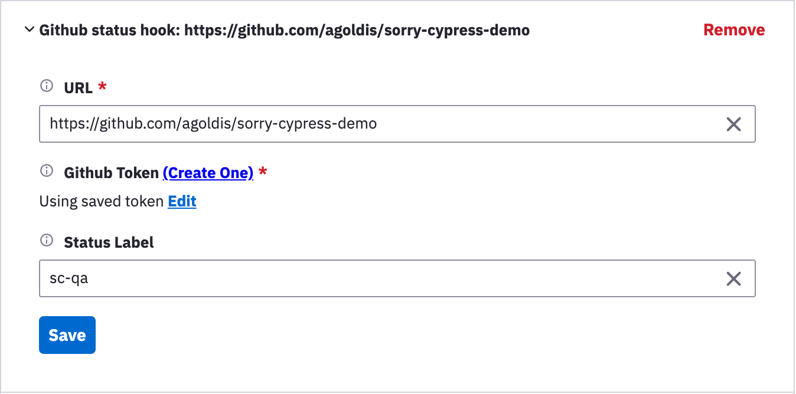

# GitHub Integration

Integrating with Github allows reporting [status check](https://docs.github.com/en/github/collaborating-with-issues-and-pull-requests/about-status-checks) for your commits and pull requests. Use the web dashboard Project Settings to add or edit Github Integration.



Sorry-cypress would update commit status to failure / success and provide a short tests summary status.


If you are using the in-memory director and do not have a dashboard you can add hooks to your project via a HTTP `POST` to the `/hooks` route of your director..
Ensure your "projectId" matches that in your cypress.json or cypress.config.js that you wish to add hooks to. Note this will replace all the hooks for the given projectId.

```
//Example POST body to localhost:1234/hooks

{
  "projectId": "test",
  "hooks": [
    {
      "hookId": "1",
      "url": "http://localhost:3005",
      "hookType": "GITHUB_STATUS_HOOK",
      "githubAuthType": "token",
      "githubToken": "token",
      "githubContext": "context",
      "githubAppPrivateKey": "key",
      "githubAppId": "id",
      "githubAppInstallationId": "installId"
    }
  ]
}

```