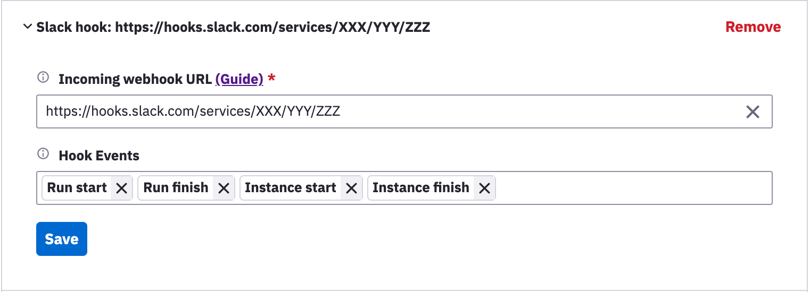

# Slack Integration

Sorry-cypress integrates with [Slack Webhooks API](https://api.slack.com/messaging/webhooks). Use the web dashboard Project Settings to add or edit Slack Integration.

Here's an example of Slack message posted by sorry-cypress:

