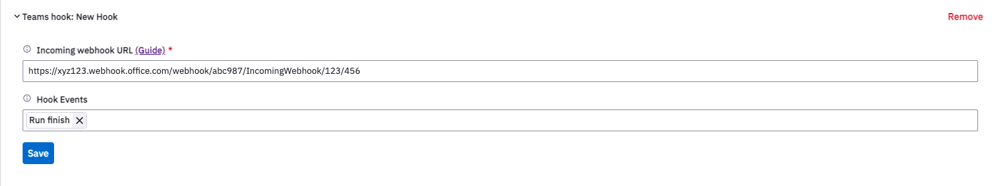

# MS Teams Integration

Sorry-cypress integrates with [MS Teams Webhooks](https://docs.microsoft.com/en-us/microsoftteams/platform/webhooks-and-connectors/how-to/add-incoming-webhook). Use the web dashboard Project Settings to add or edit Teams Integration. Also you can filter messages by event type.



If you are using the in-memory director and do not have a dashboard you can add hooks to your project via a HTTP `POST` to the `/hooks` route of your director. 
Ensure your "projectId" matches that in your cypress.json or cypress.config.js that you wish to add hooks to. Note this will replace all the hooks for the given projectId.

```
//Example POST body to localhost:1234/hooks

{
  "projectId": "test",
  "hooks": [
    {
      "hookId": "1",
      "url": "http://localhost:3005",
      "hookEvents": [
        "INSTANCE_FINISH",
        "RUN_FINISH"
      ],
      "hookType": "TEAMS_HOOK"
    }
  ]
}

```
